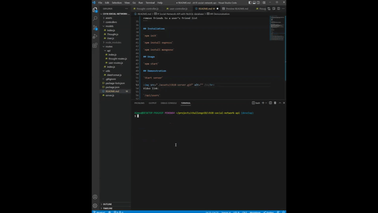

# Social-Network-API with NoSQL database

## Description

An API for a social network web application that users share their thought and get reactions from friends. Users, users' thoughts, reactions to the thoughts, friends list can be searched, created, updated, and deleted, respectively.

## Built with

- JavaScript
- express
- MongoDB
- mongoose
- npm

## User Story

```
AS A social media startup
I WANT an API for my social network that uses a NoSQL database
SO THAT my website can handle large amounts of unstructured data
```

## Acceptance Criteria

```
GIVEN a social network API
WHEN I enter the command to invoke the application
THEN my server is started and the Mongoose models are synced to the MongoDB database
WHEN I open API GET routes in Insomnia for users and thoughts
THEN the data for each of these routes is displayed in a formatted JSON
WHEN I test API POST, PUT, and DELETE routes in Insomnia
THEN I am able to successfully create, update, and delete users and thoughts in my database
WHEN I test API POST and DELETE routes in Insomnia
THEN I am able to successfully create and delete reactions to thoughts and add and remove friends to a user’s friend list
```

## Installation

`npm init`

`npm install express`

`npm install mongoose`

## Usage

`npm start`

## Demonstration

### Start server

</br>
Video link: https://drive.google.com/file/d/1CFb-JpyaUi8DtkF8HV6Uk9Usa60qkX3I/view

### Users

`/api/users`

- `GET` all users, and a user by id, `POST` a new user, `PUT` to update a user by id, `DELETE` a user by id and associated thoughts (bonus)

</br>
Video link: https://drive.google.com/file/d/1V8xKM4xx2BCjqyvIL0HxDp4zEOfM5FzE/view

### Friends

`/api/users/:userId/friends/:friendId`

- `POST` a new friend to a user's friend list, `DELETE` a friend from a user's friend list

</br>
Video link: https://drive.google.com/file/d/1VVud7UgGvA0oeJ_47IggT4NRFG1BNrTa/view

### Thoughts

`/api/thoughts/`

- `GET` all thoughts, and a thought by id, `POST` a new thought, `PUT` to update a thought by id, `DELETE` a thought by

</br>
Video link: https://drive.google.com/file/d/1fOv0lKfgyrhVDtWogTwu4qz3F6faALKE/view

### Reactions

`/api/thoughts/:thoughtId/reactions`

- `POST` a reaction stored in a thought's reactions array field, `DELETE` to pull and remove a reaction by reactionId

</br>
Video link: https://drive.google.com/file/d/1RlH4WF9fjKo1ULNZBYiy7uNNVOKN2mhj/view
